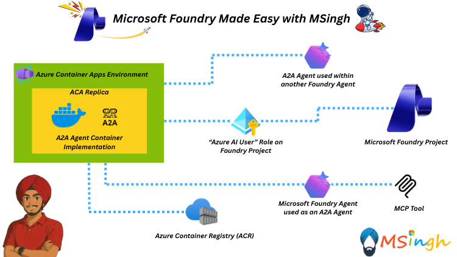

## Deploying A2A Agent in Azure Container Apps (ACA)



### Lab Overview
In this lab, you will deploy the A2A Agent within an Azure Container App (ACA) environment. This setup allows for scalable and managed deployment of the A2A Agent, enabling it to interact with other services in your Azure ecosystem or the internet.

### Setting Export Variables

Let's quickly set up some export variables for script usage.

```bash
export ACR_NAME="YOUR_ACR_NAME"
export RG_NAME="YOUR_RESOURCE_GROUP_NAME"
export ACA_ENV_NAME="YOUR_ACA_ENV_NAME"
export FOUNDRY_PROJECT_ENDPOINT="YOUR_FOUNDRY_PROJECT_ENDPOINT"
export MODEL_DEPLOYMENT_NAME="YOUR_MODEL_DEPLOYMENT_NAME"
export MCP_TOOL_CONNECTION_NAME="YOUR_MCP_TOOL_CONNECTION_NAME"
export MCP_SERVER_URL="YOUR_MCP_SERVER_URL"
export AGENT_CARD_URL="YOUR_AGENT_CARD_URL"
```

### Building the A2A Agent Docker Image

The A2A Agent Docker image is built using the provided Dockerfile in the A2A_Server directory. Navigate to that directory and build the Docker image.

```bash
# navigate to the server directory
cd A2A_Server

# build the docker image
docker build -t $ACR_NAME.azurecr.io/a2a-agent:latest .

# Log into Azure Container Registry
az acr login --name $ACR_NAME

# Push the Docker Image to ACR
docker push $ACR_NAME.azurecr.io/a2a-agent:latest
```

### Publishing the A2A Server to Azure Container Apps

Now that the Docker image is pushed to Azure Container Registry, you can deploy it to Azure Container Apps.

```bash
az containerapp create \
    -g $RG_NAME -n udemy-demo-a2a-server \
    --image $ACR_NAME.azurecr.io/a2a-agent:latest \
    --environment $ACA_ENV_NAME \
    --target-port 8080 \
    --min-replicas 1 \
    --ingress external \
    --registry-server $ACR_NAME.azurecr.io \
    --registry-identity system \
    --system-assigned \
    --env-vars FOUNDRY_PROJECT_ENDPOINT=$FOUNDRY_PROJECT_ENDPOINT MODEL_DEPLOYMENT_NAME=$MODEL_DEPLOYMENT_NAME MCP_TOOL_CONNECTION_NAME=$MCP_TOOL_CONNECTION_NAME MCP_SERVER_URL=$MCP_SERVER_URL AGENT_CARD_URL=$AGENT_CARD_URL
```

### Verifying the Deployment

After the ACA instance is created, you can navigate to the `./well-known/agent.json` endpoint of your ACA to verify that the A2A Agent is running correctly.

### Assigning Managed Identity Roles to Azure Container App Instance

Before you can use the A2A Agent, you need to assign the necessary roles to the managed identity of your Azure Container App instance. 

Assign the system managed identity for the create container apps instance with the `Azure AI User` role on the AI Services (Microsoft Foundry) Resource and assign it to your ACA instance.

### Summary
In this lab, you successfully deployed the A2A Agent within an Azure Container App environment. This setup allows for scalable and managed deployment, enabling the A2A Agent to interact with other services in your Azure ecosystem or the internet.

